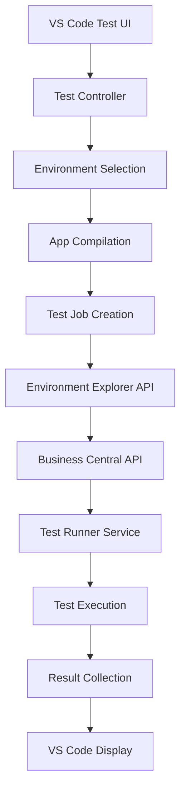

# Test Execution Plan - Continia AL Test Runner Deep Dive

## Overview
This document provides a comprehensive technical analysis of how the Continia AL Test Runner discovers and executes tests in Business Central environments. This analysis is based on deep investigation of the codebase at `C:\GeneralDev\MCPDevelopment\AL Developer Tools - Continia AL Test Runner`.

## 1. Test Discovery Process

### 1.1 Discovery Entry Points
**Primary File**: `vscode-extension\src\testController.ts`

#### Key Functions:
- `discoverTests()` (line 52-70) - Main entry point for test discovery
- `discoverTestsInDocument()` (line 93-104) - Discovers tests in specific documents
- `discoverTestsInDocumentWithALFile()` (line 106-141) - Core discovery logic

### 1.2 File Scanning Process

#### Step 1: Find Test Codeunits
```typescript
// testController.ts, line 58
const testCodeunitFiles = await getALFilesInWorkspace(undefined, undefined, true);
```

**Implementation** (`alFileHelper.ts`, line 101-137):
- Scans workspace for `.al` files
- Filters for test codeunits using regex: `/Sub(t|T)ype *= *(t|T)est;/`
- Uses `readFileSync` for performance (avoids opening documents)

#### Step 2: Parse AL Objects
**Function**: `getALFilesInWorkspace()` (`alFileHelper.ts`, line 10-18)

Extracts:
- **Codeunit ID**: Using regex `"(?<=codeunit )[0-9]+"`
- **Codeunit Name**: From AL object declaration
- **File Path**: Absolute path to .al file

#### Step 3: Discover Test Methods
**Function**: `getTestMethodRangesFromDocument()` (`alFileHelper.ts`, line 274-311)

Process:
```typescript
// Search for [Test] attributes
const testAttributeRegex = /\[Test\]/gi;
// Extract procedure names after [Test]
const procedureRegex = /procedure\s+(\w+)/;
```

Filters out:
- Commented tests (line 298, 313-329)
- Invalid method declarations
- Nested procedures

#### Step 4: Create Test Items
**Location**: `testController.ts`, line 119-140

Creates VS Code TestItem hierarchy:
```typescript
// Create codeunit test item
const codeunitItem = testController.createTestItem(
    codeunitId,
    codeunitName,
    fileUri
);

// Add method test items as children
for (const method of testMethods) {
    const methodItem = testController.createTestItem(
        methodId,
        methodName,
        fileUri
    );
    codeunitItem.children.add(methodItem);
}
```

### 1.3 Parameters Extracted During Discovery

| Parameter | Type | Source | Usage |
|-----------|------|--------|--------|
| Codeunit ID | Integer | AL file content | Unique identifier for test execution |
| Codeunit Name | String | AL declaration | Display name in VS Code |
| Test Method Name | String | Procedure declaration | Individual test identification |
| File Path | String | File system | Navigation and compilation |
| Line Ranges | VS Code Range | Text parsing | Code navigation |
| Disabled Status | Boolean | disabledTestsCloud.json | Skip test execution |

## 2. Test Execution Architecture

### 2.1 High-Level Flow



### 2.2 Detailed Execution Steps

#### Step 1: Environment Selection
**File**: `testController.ts`, line 152
```typescript
const environment = await SelectEnvironment();
// Calls: vscode.commands.executeCommand('environment-explorer.select-environment')
```

Returns `BcEnvironment` object:
```typescript
interface BcEnvironment {
    id: string;
    url: string;
    status: string;
    artifactUrl: string;
    createdUtc: string;
    // ... additional properties
}
```

#### Step 2: Compilation and Publishing
**File**: `publish.ts`, line 13-17
```typescript
const success = await vscode.commands.executeCommand<boolean>(
    'environment-explorer.compile-workspace-with-deps',
    fsPath,
    environment
);
```

Process:
1. Compiles AL code with dependencies
2. Publishes app to BC instance
3. Returns success/failure status
4. Handles compilation errors

#### Step 3: Test Job Creation
**File**: `extension.ts`, line 151-173
```typescript
function getTestItemAsTestJob(testItem: vscode.TestItem, environment: BcEnvironment): ALTestJob {
    return {
        testCodeunitId: extractCodeunitId(testItem),
        testFunctionName: isMethod ? testItem.label : "",
        testFilePath: testItem.uri.fsPath,
        testFileWorkspaceFolder: workspaceFolder,
        environment: environment
    };
}
```

#### Step 4: Test Execution Request
**File**: `testController.ts`, line 347-357
```typescript
const alTestJob = await vscode.commands.executeCommand<string>(
    'environment-explorer.runtest-in-environment',
    testJob,
    testJob.environment
);
```

Returns `ALEnvironmentTestJob`:
```typescript
interface ALEnvironmentTestJob {
    environmentId: string;
    jobId: number;
    testTimeout: number;
}
```

## 3. API Integration and Execution Mechanisms

### 3.1 Primary Method: Environment Explorer Delegation

The test runner delegates execution to Environment Explorer extension:
- **Authentication**: Handled by Environment Explorer
- **API Communication**: Abstracted away
- **Job Management**: Queuing and monitoring
- **Result Retrieval**: Standardized interface

### 3.2 Debug Mode: Direct SOAP Calls

**File**: `testRunnerService.ts`, line 34-70

#### SOAP Request Structure:
```xml
<soapenv:Envelope xmlns:soapenv="http://schemas.xmlsoap.org/soap/envelope/"
                  xmlns:testns="urn:microsoft-dynamics-schemas/codeunit/TestRunner">
    <soapenv:Header/>
    <soapenv:Body>
        <testns:RunTest>
            <testns:codeunitId>60151</testns:codeunitId>
            <testns:testName>MyTestMethod</testns:testName>
        </testns:RunTest>
    </soapenv:Body>
</soapenv:Envelope>
```

#### Endpoint Format:
```
{baseUrl}/WS/{companyName}/Codeunit/TestRunner
```
Example: `https://mybc.azurewebsites.net/WS/CRONUS%20USA%2C%20Inc./Codeunit/TestRunner`

#### HTTP Configuration:
```typescript
const config = {
    method: 'POST',
    url: endpoint,
    headers: {
        'Content-Type': 'application/xml',
        'SOAPAction': 'Read'
    },
    auth: {
        username: credentials.username,
        password: credentials.password
    },
    data: soapBody
};
```

### 3.3 Business Central Service Implementation

#### Test Runner Service Codeunit
**File**: `bc-app/src/Service/TestRunner.Codeunit.al`
```al
codeunit 60150 "Test Runner Service CS"
{
    [ServiceEnabled]
    procedure RunTest(CodeunitId: Integer; TestName: Text)
    {
        TestRunner.SetCodeunitId(CodeunitId);
        TestRunner.SetTestName(TestName);
        TestRunner.Run();
    }
}
```

#### Test Runner Implementation
**File**: `bc-app/src/Service/TestRunner.Codeunit.al`
```al
codeunit 60151 "Test Runner CS"
{
    Subtype = TestRunner;
    TestIsolation = Codeunit;

    trigger OnRun()
    {
        if TestCodeunitId <> 0 then
            Codeunit.Run(TestCodeunitId);
    }

    trigger OnBeforeTestRun(CodeunitID: Integer; CodeunitName: Text;
                             FunctionName: Text; FunctionTestPermissions: TestPermissions): Boolean
    {
        // Filter logic for selective test execution
        exit((TestCodeunitId = CodeunitID) and
             ((TestFunctionName = '') or (TestFunctionName = FunctionName)));
    }

    trigger OnAfterTestRun(CodeunitID: Integer; CodeunitName: Text;
                           FunctionName: Text; FunctionTestPermissions: TestPermissions;
                           Success: Boolean)
    {
        // Result collection and storage
    }
}
```

Key Properties:
- **Subtype = TestRunner**: Integrates with BC test framework
- **TestIsolation = Codeunit**: Each test runs in isolation
- **Triggers**: Hook into test lifecycle

## 4. Result Collection and Processing

### 4.1 Result XML Retrieval
**File**: `extension.ts`, line 175-185
```typescript
const resultXml = await vscode.commands.executeCommand<string>(
    'environment-explorer.get-test-job-result',
    testJob
);
```

### 4.2 XML Result Structure
**File**: `types.ts`, line 58-96

```xml
<assembly time="0.15" skipped="0" failed="1" passed="3" total="4"
          run-time="00:00:15" run-date="2024-01-15"
          test-framework="AL Test Runner" name="Codeunit 50100">
    <collection name="Test Methods">
        <test method="TestMethod1" name="Test Method 1" result="Pass" time="0.05">
        </test>
        <test method="TestMethod2" name="Test Method 2" result="Fail" time="0.03">
            <failure>
                <message>Assertion failed: Expected 10, Got 5</message>
                <stack-trace>Codeunit 50100, Line 42</stack-trace>
            </failure>
        </test>
    </collection>
</assembly>
```

### 4.3 Code Coverage Collection
**File**: `extension.ts`, line 187-195
```typescript
const resultCsv = await vscode.commands.executeCommand<string>(
    'environment-explorer.get-test-job-codecoverage',
    testJob
);
```

CSV Format:
```csv
ObjectType, ObjectID, LineType, LineNo, NoOfHits
Codeunit, 50100, Code, 42, 3
Codeunit, 50100, Code, 43, 3
Codeunit, 50100, Code, 45, 0
```

### 4.4 Code Coverage SOAP Call
**File**: `testRunnerService.ts`, line 72-99

Request:
```xml
<soapenv:Envelope xmlns:soapenv="http://schemas.xmlsoap.org/soap/envelope/"
                  xmlns:tes="urn:microsoft-dynamics-schemas/codeunit/TestRunner">
    <soapenv:Header/>
    <soapenv:Body>
        <tes:GetCodeCoverage/>
    </soapenv:Body>
</soapenv:Envelope>
```

BC Implementation (`CodeCoverage.Codeunit.al`):
```al
procedure SaveCodeCoverage()
var
    CodeCoverage: Record "Code Coverage";
    OutStr: OutStream;
begin
    CodeCoverage.SetFilter("Object ID", '%1..%2|%3..%4',
        50000, 99999, 1000000, 74999999);
    Xmlport.Export(Xmlport::"Export Code Coverage CS", OutStr, CodeCoverage);
    // Store in IsolatedStorage for retrieval
end;
```

## 5. Technology Stack

### 5.1 Frontend (VS Code Extension)
| Component | Technology | Version | Purpose |
|-----------|------------|---------|---------|
| Language | TypeScript | 4.x | Type-safe development |
| Framework | VS Code Extension API | 1.88.0 | IDE integration |
| HTTP Client | Axios | 0.24.0 | SOAP/REST calls |
| XML Parser | xml2js | 0.5.0 | Result parsing |
| Testing | Mocha | - | Unit tests |

### 5.2 Backend (Business Central)
| Component | Technology | Purpose |
|-----------|------------|---------|
| Language | AL | Business logic |
| Platform | Business Central | ERP system |
| Test Framework | Native BC Testing | Test execution |
| APIs | SOAP Web Services | External communication |
| APIs | OData | Data queries |

### 5.3 Integration Layer
Environment Explorer Extension provides:
- Environment management
- Authentication handling
- API abstraction
- Job orchestration
- Result aggregation

## 6. Execution Modes

### 6.1 Normal Test Execution
```
User → VS Code Test UI → Test Controller → Environment Explorer
→ BC API → Test Runner Service → Test Execution
→ Result XML → Test Controller → VS Code UI
```

### 6.2 Debug Test Execution
```
User → VS Code Debug → Test Controller → Attach Debugger
→ Direct SOAP Call → Test Runner Service → Test Execution (with breakpoints)
→ SOAP Response → VS Code Debug Session
```

### 6.3 Configuration Options

| Setting | Description | Default |
|---------|-------------|---------|
| runTestsAtFunctionLevel | Run individual methods vs entire codeunit | false |
| testTimeout | Maximum test execution time (ms) | 120000 |
| enableCodeCoverage | Collect code coverage data | true |
| compileBeforeRun | Compile app before test execution | true |

## 7. Key Design Patterns and Optimizations

### 7.1 Design Patterns
1. **Delegation Pattern**: Test Runner delegates to Environment Explorer
2. **Adapter Pattern**: VS Code Test API adapted to BC framework
3. **Observer Pattern**: File watchers for auto-discovery
4. **Command Pattern**: VS Code commands for inter-extension communication
5. **Factory Pattern**: Test job creation from test items

### 7.2 Performance Optimizations
1. **Parallel File Processing**: `Promise.all()` for discovery
2. **Direct File Reading**: `readFileSync` instead of document API
3. **Selective Discovery**: Only reads test codeunits
4. **Compilation Caching**: Tracks compilation per workspace
5. **Incremental Updates**: File watchers for changes

### 7.3 Error Handling
1. **SOAP Fault Parsing**: Structured error extraction
2. **Timeout Management**: Configurable per test/suite
3. **Compilation Validation**: Pre-execution checks
4. **Disabled Test Handling**: Configuration-based skipping
5. **Retry Logic**: For transient failures

## 8. Implementation Blueprint for MCP

### 8.1 Required Components
1. **Test Discovery Service**
   - AL file parser
   - Test method extractor
   - Metadata collector

2. **Execution Engine**
   - Environment connector
   - SOAP client implementation
   - Job orchestrator

3. **Result Processor**
   - XML parser
   - CSV parser
   - Result aggregator

4. **API Client**
   - Authentication manager
   - HTTP/SOAP client
   - Response handler

### 8.2 MCP Tool Definitions
```typescript
// Proposed MCP tools
interface TestTools {
    discoverTests(path: string): TestItem[];
    runTest(codeunitId: number, methodName?: string): TestResult;
    getTestResults(jobId: string): TestAssembly;
    getCodeCoverage(jobId: string): CodeCoverageData;
}
```

### 8.3 Integration Points
1. **Environment Explorer API** (if available)
2. **Direct SOAP Services** (fallback)
3. **File System** (test discovery)
4. **Business Central APIs** (execution)

## 9. Critical Implementation Notes

### 9.1 Authentication
- Basic Auth for SOAP calls
- Credential storage via Environment Explorer
- Session management for long-running tests

### 9.2 Concurrency
- Single test execution per environment
- Queue management for multiple requests
- Result caching for efficiency

### 9.3 Limitations
- Test isolation at codeunit level only
- No parallel test execution within BC
- SOAP timeout constraints
- File size limits for result XML

## 10. Next Steps for MCP Implementation

1. **Phase 1**: Implement test discovery
   - Parse AL files
   - Extract test metadata
   - Build test registry

2. **Phase 2**: Basic execution
   - SOAP client setup
   - Single test execution
   - Result retrieval

3. **Phase 3**: Advanced features
   - Batch execution
   - Code coverage
   - Error handling

4. **Phase 4**: Optimization
   - Caching layer
   - Queue management
   - Performance tuning

## Conclusion

The Continia AL Test Runner provides a sophisticated test execution framework that leverages both VS Code's testing capabilities and Business Central's native test framework. The architecture emphasizes separation of concerns, with the Test Runner focusing on UI/UX while delegating infrastructure concerns to the Environment Explorer.

For our MCP implementation, we should focus on replicating the core discovery and execution mechanisms while adapting the interface for LLM interaction rather than VS Code UI.